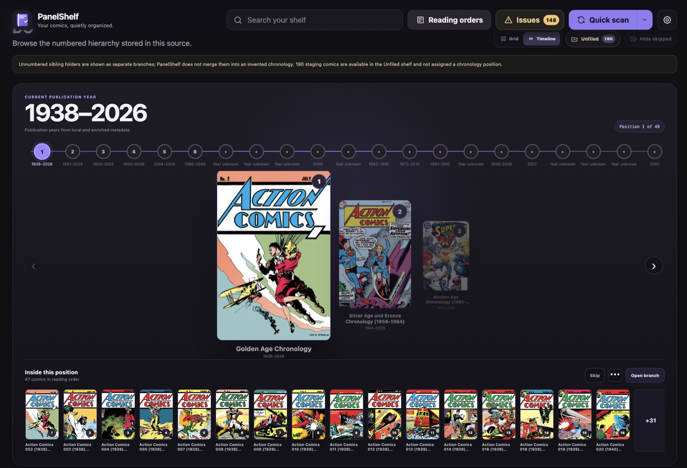
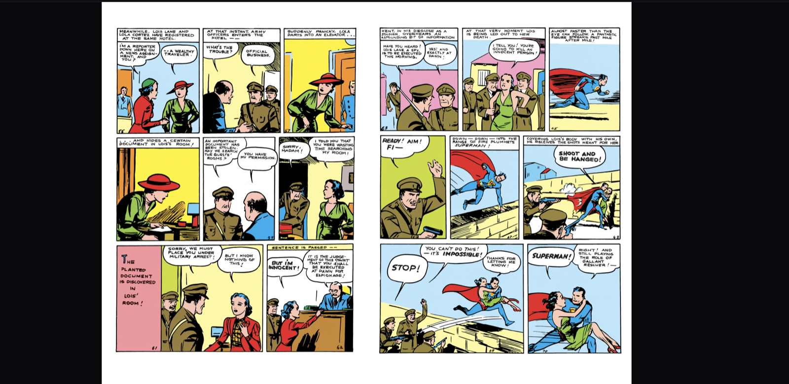

# PanelShelf

**Your comics, quietly organized.**

PanelShelf is a lightweight comic library and browser reader packaged natively
for Synology DSM 7.2 or newer. It scans CBZ and CBR files in one or more
folders, extracts covers, and serves comic pages without modifying the original
archives.



> **This is a preview.** PanelShelf has no user accounts and terminates no TLS
> of its own. It is built to sit on a home LAN. Please read
> [Security scope](#security-scope) before installing it, and do not forward
> its port to the internet.

<details>
<summary>More screenshots</summary>

<br>

**The reader**, in double-page mode with fit-to-width:



</details>

## Downloads

Built packages are published as GitHub releases:

- **Nightly** — the rolling [`nightly`](../../releases/tag/nightly) prerelease,
  rebuilt from `main` daily and on every push, with SPKs for `x86_64`, `armv8`,
  and `armv7` plus a source archive and `.sha256` files.
- **Versioned** — pushing a `v*` tag (for example `v0.4.4-1025`) builds and
  publishes a full release from `RELEASE_NOTES.md`.

Packages are unsigned; install through **Package Center → Manual Install** and
allow packages from any publisher.

## Security scope

**Read this before exposing PanelShelf to anything.**

PanelShelf has no user accounts. Whatever can reach port 8251 can read the
library and change its settings, so do not forward that port to the internet.
If you want remote access, put it behind an authenticated HTTPS reverse proxy
or a VPN.

Being "only on the LAN" is not by itself a boundary. Every browser on the
network can be driven by whichever page it happens to be showing, which makes
it a usable route in from outside. PanelShelf therefore refuses:

- a request whose `Origin` is not its own, so a page on the internet cannot
  drive the API through a browser that is already indoors
- a request whose `Host` it does not answer to, which is what DNS rebinding
  turns on
- a request body that is not `application/json`, which closes the one mutating
  request a browser will send cross-origin without asking permission first

Native clients send no `Origin` and are unaffected. Behind a reverse proxy,
which legitimately rewrites both headers, set `PANELSHELF_ALLOWED_HOSTS` to the
names it serves, comma separated.

The folder browser exposes only mounted Synology volume paths. PanelShelf never
offers browsing of DSM system directories.

### Device pairing

PanelShelf can require every client to be paired. It is off by default, because
turning it on locks out every client that has not paired yet — including OPDS
readers — and that is the owner's decision rather than an upgrade's.

Enable it in **Library settings**. The browser that turns it on is paired in the
same step, so you cannot lock yourself out of the page you are looking at. To
pair anything else, generate an eight-character code and type it into the other
client within five minutes; the token it receives is shown once and stored only
as a hash here.

| Method | Path | Purpose |
|---|---|---|
| GET | `/api/devices` | Whether pairing is on, and what is paired |
| POST | `/api/devices/enable` | Turn it on and pair the calling browser |
| POST | `/api/devices/disable` | Turn it off; paired devices are kept |
| POST | `/api/devices/pairing-code` | An eight-character code, good for five minutes, once |
| POST | `/api/devices/pair` | Exchange a code for a token; needs no token itself |
| DELETE | `/api/devices/:deviceId` | Revoke a device, effective on its next request |

Clients send `Authorization: Bearer <token>`. OPDS readers, which can only send
HTTP Basic, put the token in the password field and anything in the username.
`/api/health` and `/api/discovery` stay open so a client can tell a wrong
address from an unpaired server.

If pairing is on and every client has lost its token, recovery means setting
`enabled` to `false` in `devices.json` in the data directory, over SSH.

Found a vulnerability? Please report it privately rather than as an issue —
see [SECURITY.md](SECURITY.md).

## Version 0.4 preview features

- Native DSM package with start, stop, status, desktop shortcut, and firewall
  port registration
- Recursive CBZ and CBR scanning
- Multiple internal and USB source folders
- Per-source organization profiles: Loose comics, Folders as series,
  Hierarchical timeline, Exact reading order, and an explicit Unordered
  fallback
- Read-only source analysis with automatic layout detection, publisher
  recognition, validation, and a folder-role preview
- Numeric timeline positions including mixed-width and dotted values such as
  `09`, `010`, `029.1`, and `36.001`
- Automatic migration from the 0.1 `libraryPaths` configuration
- Last-known comics retained when a removable source is disconnected
- Server-side folder browser for mounted `/volume*` and `/volumeUSB*` paths
- Read-only `ComicInfo.xml` metadata from CBZ and CBR archives, including
  title, series, issue, volume, year, publisher, creators, genres, and summary
- Optional, manual smart matching across GCD, Metron, and Open Library, with
  candidate scoring, review, confirmed-match caching, and no background lookup
- Confirmed online metadata fills missing fields while embedded
  `ComicInfo.xml` remains authoritative; an **M** badge identifies a match
- Quick, single-source, retry-issues, and full-rebuild scan actions
- Searchable cover grid
- Main-library views for All comics, recognized Publishers, and safe
  Chronological hierarchy browsing
- Grid and focused Timeline visualizations for chronological branches, with a
  numbered rail, cover carousel, contained-comic strip, keyboard navigation,
  and a prominent current publication year
- Fallback publication-year inference from parenthetical filename tags such as
  `(2014)` and `(2006 MinuteMan)`, superseded automatically by richer metadata
- Publisher grouping recognizes both publisher folders and a publisher selected
  directly as the source root
- Chronology cards show larger, simple sibling sequence numbers such as
  `1`, `2`, and `3`, independent of zero-padded or dotted folder prefixes
- Chronology folders can be marked Skipped, visually muted, and hidden with a
  browser-local filter
- Chronological browsing exposes `_` staging folders on a dedicated Unfiled
  shelf without assigning them invented chronology positions
- Every comic card has a shelf-status menu for Unread, In progress, Completed,
  and Skipped
- Continue Reading plus unread, in-progress, completed, and skipped states
  saved in the current browser
- Automatic folder/series reading contexts and user-created manual
  chronologies
- Reading-order detail views with cover, description, item count, and progress
- Drag-and-drop manual chronology editor with multi-select and an Unplaced area
  for comics discovered by later scans
- Stable comic identity across unambiguous file moves within one source
- Context-aware Next Comic navigation skips books marked Skipped; folder and
  series contexts stop at their boundary, while exact and manual orders may
  cross folders
- Full-screen browser reader with keyboard and touch-friendly navigation
- Single-page, double-page, manga/right-to-left, and continuous-scroll modes
- Fit-width and fit-height reading modes
- Read-only archive access
- Read-only OPDS 1.2 catalogs for compatible reader apps, including All
  comics, Publishers, Sources and folders, search, and Reading orders
- Portable backup and restore for source settings, manual reading orders,
  confirmed metadata matches, server-side reading progress, and browser-local
  chronology/reader preferences
- Persistent configuration and library index

## Install on the DS1825+

1. Open **DSM → Package Center → Manual Install**.
2. Select `PanelShelf-x86_64-0.4.11-1032.spk`.
3. Accept the warning for a third-party package.
4. Start PanelShelf and click **Open**, or visit:
   `http://YOUR-NAS-IP:8251/`
5. Open **Library settings**, browse to a comics folder, review the detected
   structure, then choose **Save and scan**.
6. Use **All comics**, **Publishers**, or **Chronological** on the main shelf.
   Open **Reading orders** when you want to build a custom sequence that spans
   folders and series.

## Supported source conventions

PanelShelf asks you to confirm one convention for each source:

- **Loose comics:** CBZ/CBR files live directly in the selected folder.
- **Folders as series:** each first-level folder is a series, with one optional
  volume or arc level.
- **Hierarchical timeline:** numbered sibling folders are ordered within their
  own branch; unnumbered folders remain groups and `_` folders are unfiled.
- **Exact reading order:** every participating file or branch has a unique
  numeric position.
- **Unordered library:** recursive indexing without claiming a chronology.

The structure preview labels publisher containers, ordered sections, groups,
series, unfiled folders, and ignored empty folders. It never writes to, moves,
or renames source content.

## Embedded metadata

When an archive contains `ComicInfo.xml`, PanelShelf reads it without changing
the CBZ or CBR. Embedded title, series, issue, volume, date, publisher, imprint,
creator, genre, tag, story-arc, language, rating, and summary fields are stored
in PanelShelf's private index. An **XML** badge identifies comics with embedded
metadata.

Embedded series and issue numbers improve series display and local issue
ordering, but they never create a cross-folder chronology. Numbered folders,
Exact reading-order positions, and manual reading orders remain authoritative.
A malformed `ComicInfo.xml` appears as a warning while the comic and its image
pages remain available.

After upgrading from a build before 1014, run one **Full rebuild** to read
metadata from comics that were already indexed.

## Optional online metadata

PanelShelf 0.4.3 can search one comic at a time with this fallback order:

1. **Grand Comics Database (GCD):** primary comics and collected-edition
   matching, with no key required.
2. **Metron:** optional second source when the NAS owner supplies a personal
   token.
3. **Open Library:** no-key fallback for trade paperbacks, hardcovers,
   omnibuses, and graphic novels.

The search dialog keeps series and title/subtitle separate and scores candidates
from series, issue or volume, subtitle, year, publisher, and edition. Smart
fallback stops when a provider returns a strong match; the user can also choose
one provider explicitly. Filenames such as
`Avengers Arena v01 - Kill Or Die (2013)` prefill the trade format, volume,
subtitle, and year for review.

PanelShelf never contacts a provider during a library scan and never uploads an
archive or page image. Individual searches remain review-first. The separate
**Enrich metadata** job checks only unmatched comics and automatically attaches
a result only when it scores at least 90% and leads the runner-up by at least 10
points. Existing confirmed matches are never replaced; ambiguous results remain
available for manual review.
Embedded `ComicInfo.xml` values always win, and online story arcs never affect
folder chronology.

Metron tokens are stored in permission-restricted package data and returned to
the browser only as masked hints. Verify every provider's current terms before
shipping a paid release.

Search and record results are cached to reduce requests. If a provider is
unavailable, local scans and reading continue normally and cached confirmed
matches remain usable. GCD and Open Library cover images are not redistributed;
PanelShelf keeps using the archive's local cover.

## OPDS reader access

Compatible reader apps can connect to:

`http://YOUR-NAS-IP:8251/opds`

The OPDS 1.2 catalog provides All comics, Publishers, Sources and folders,
automatic and manual Reading orders, search, local cover images, and direct
CBZ/CBR acquisition with byte-range support. Reading-order feeds preserve the
order stored by PanelShelf.

OPDS access is read-only. Reader-app progress is not synchronized back to
PanelShelf, because generic OPDS 1.2 does not define a universal progress
protocol. This preview is intended for a trusted LAN and does not yet protect
the OPDS catalog with user authentication.

## Library API

| Method | Path | Purpose |
|---|---|---|
| GET | `/api/comics` | Every comic in full, newest merged metadata included |
| GET | `/api/comics?q=…` | The same records, filtered by a free-text search |
| GET | `/api/comics?view=compact` | The same comics, reduced to what a browsing list draws |
| GET | `/api/comics/:comicId` | One comic in full, without opening its archive |
| GET | `/api/comics/:comicId/pages` | The comic in full plus its page list; opens the archive |
| GET | `/api/comics/:comicId/cover` | The comic's first page, full size |
| GET | `/api/comics/:comicId/cover?size=thumb` | The same cover shrunk to grid size |
| GET | `/api/comics/:comicId/pages/:index` | One page, full size |

`:comicId` is a 24-character lowercase hex id; any other shape falls through to
the generic `404`. An id that is well formed but not in the library answers
`404 NOT_FOUND`.

### `?size=thumb`

A cover is a scanned comic page: the ones in a 26,625-comic library here run
around 774 KB at 1074×1650. A shelf draws them into cards a couple of hundred
pixels wide, so a screenful of twenty-four cards moves roughly 18 MB to paint
about 1.5 MB worth of pixels.

`?size=thumb` answers with the same cover scaled so its **longest edge is at
most 480 pixels**, re-encoded as JPEG — around 54 KB for that same cover, a
fourteenth of the bytes. 480 is chosen for the client that needs the most: an
iPad grid card is roughly 140–180pt wide, so a Retina panel wants 280–360
device pixels across, and a 2:3 cover 480 tall is 320 across.

The size is fixed, not a parameter. A caller-chosen width would multiply the
on-disk cache by every size anyone ever asked for and would let one client walk
a NAS CPU through a thousand resizes. `size` accepts only `thumb` and `full`;
anything else is `400 INVALID_SIZE`.

Omitting `size` still returns the untouched original bytes with the original
content type, so existing clients are unaffected. `size=thumb` is served as
`image/jpeg`.

Thumbnails are generated the first time one is asked for — not during a scan,
which would add an image decode and encode per comic to every scan for covers
most users never scroll past — and cached in the data directory next to the
full-size covers. The first request for a given cover costs one decode and
encode; every later one is a file read. A cover already smaller than a card, or
in a format the server's pure-JavaScript image code cannot read, is served
whole, so `size=thumb` can legitimately answer with the full-size image and its
own content type.

Resizing is done without a native image library, because the Synology package
bundles its own Node runtime and is built for three architectures from one
tree. The server decodes baseline and progressive JPEG and PNG itself, running
the inverse DCT at the smallest scale that still covers the thumbnail.

### `?view=compact`

The full record is about 2.8 KB per comic — 71 MB across a 26,625-comic
library, most of it three metadata blocks that largely duplicate each other.
A client that only needs to draw a shelf can ask for the compact form instead,
which is roughly 5 MB across the same library:

```json
{
  "id": "2fbd2c1f2a4f0a6c9d4e5b71",
  "title": "Saga 01",
  "series": "Saga",
  "pageCount": 44,
  "available": true,
  "format": "cbz",
  "publisher": { "name": "Image Comics" }
}
```

Those seven fields are the whole record — there are no others. `title` and
`series` are the same display values the full record computes, so a comic with
a manual override or a confirmed online match reads the same on a shelf as on a
detail screen, and `publisher` keeps only its `name`.

**What compact omits:** `metadata`, `embeddedMetadata`, `sourceMetadata`,
`inferredMetadata`, `metadataEntry`, `metadataSources`, `manualOverride`,
`onlineMatch`, `hierarchy`, `orderPath`, `localTitle`, `localSeries`,
`relativePath`, `libraryRoot`, `sourceId`, `sourceName`, `sourceProfile`,
`size`, and `modifiedAt`. Fetch `GET /api/comics/:comicId` for any of them.

`q` still filters, and it filters against the full record — the file path,
summary, creators, genres and characters a compact response does not carry.
Only the exact value `compact` opts in; `?view=full` and any other value return
the full records, so an existing client cannot be shortened by accident.

### Checking a server against this document

```bash
npm run conformance -- http://your-nas:8251
```

Checks a running server against the contract described here: what health
reports, that `/api/v1` and `/api/…` agree and an unknown version does not
answer, the shape of the compact listing, the resync rules for
`/api/changes`, and that a foreign origin, a forged host and a non-JSON body
are all refused.

Read-only by default, because it is meant to be pointed at a real NAS. Add
`--write` to also check the progress contract — it stores one record and puts
back whatever was there. Add `--token pst_…` when pairing is on; without one it
reports which checks it could not reach rather than failing them.

### API version

Every `/api/…` route is also served under `/api/v1/…`, and the two are the same
handler: same origin, content-type and pairing checks, same responses. The
unversioned form is not deprecated and will not move — the iPad client ships
from its own repository on its own schedule, and a server that renamed its paths
would break every copy already installed. `/api/health` reports `apiVersion` so
a client can tell what it is talking to. A version this server does not speak,
such as `/api/v2/comics`, answers `404` rather than being quietly served as v1.

OPDS is not versioned. It is a published standard rather than this project's
contract.

### Incremental library changes

A client that already holds the library asks what moved rather than downloading
the catalogue again.

| Method | Path | Purpose |
|---|---|---|
| GET | `/api/changes?since=<sequence>` | What changed after that point |

The answer carries `sequence` — the point the client has now reached — and
`changes`, a list of `{ id, kind }` where `kind` is `added`, `updated` or
`removed`. A client stores the sequence and sends it back next time.

Additions and edits a client could work out for itself by comparing what it
holds against what it receives. Removals it cannot: nothing in a list of what
remains says what left. That is what the log is really for.

`reset: true` means the cursor cannot be caught up from here, and the client
should fetch `/api/comics` in full and adopt the `sequence` reported alongside.
It is the answer to a client that has never synced, to one that has been away
long enough for its cursor to fall off the end of a bounded log, and to one
holding a cursor from a data directory that has since been rebuilt. Sending a
partial history in any of those cases would leave a client quietly wrong, which
is the failure nobody notices.

### Bulk editing

| Method | Path | Purpose |
|---|---|---|
| POST | `/api/metadata/overrides/bulk` | Apply one metadata patch to many comics |
| POST | `/api/reading-orders/:orderId/comics` | Add comics to an order, keeping what is there |

A bulk metadata edit is a **patch, not a rewrite**. It merges into whatever each
comic already had overridden, so fixing a publisher across a run does not lose
the title someone corrected on one issue last week. A field sent as `null` is
cleared, which is how a wrong value comes back off a hundred comics at once.
Everything is validated before anything is applied, so a bad field cannot leave
half a selection edited, and the whole edit lands in one write rather than one
per comic.

Adding comics to a reading order appends. What is already in the order stays
where it was — filing a run into a storyline is an addition, not a rewrite of an
order somebody arranged. Ids already present, and ids for comics the library
does not have, are ignored.

### Duplicates

| Method | Path | Purpose |
|---|---|---|
| GET | `/api/duplicates` | Groups of comics that look like copies of each other |

Reporting only. There is no endpoint that resolves a duplicate, and the module
behind this one has no way to delete a file — which is a stronger promise than
a rule saying it must not, because a later change cannot make destructive
something that has nothing destructive in it.

Two kinds, and the difference is the point. **identical-contents** is
`certain`: the scan already fingerprints every file, and two files with the same
fingerprint are one comic filed twice. **same-issue** is `probable`: a CBZ and a
CBR of one issue have different bytes and are still the same comic — but so are
a raw scan and a restored version of it, and only you know which you meant to
keep.

An issue with no number is never guessed at, because grouping a run by series
alone would call every issue a duplicate of every other. A comic on an
unavailable source is left out entirely: a sleeping USB disk is not a reason to
suggest removing the copy that is still there. Groups come back with the most
reclaimable bytes first, and each carries the path, size and source of every
copy — the things you need to decide which one is the keeper.

### Reading orders: artwork, portability and repair

A reading order with a cover is what the roadmap calls a storyline. The cover is
uploaded rather than borrowed from a comic, and lives in PanelShelf's own data
directory — the library stays read-only.

| Method | Path | Purpose |
|---|---|---|
| PUT | `/api/artwork/:kind/:subject/:id` | Upload a `cover` or `banner` for a `comic` or `order` |
| GET | `/api/artwork/:kind/:subject/:id` | Serve it |
| DELETE | `/api/artwork/:kind/:subject/:id` | Remove it, falling back to what was there before |
| GET | `/api/reading-orders/:orderId/export` | The order as a portable document |
| POST | `/api/reading-orders/import` | Create an order from one |
| GET | `/api/reading-orders/:orderId/repair` | What is wrong with an order, changing nothing |
| POST | `/api/reading-orders/:orderId/repair` | Drop missing entries and de-duplicate |

Artwork is uploaded as the image itself — `image/png` or `image/jpeg` — which is
the one exception to the JSON-only body rule. The content decides what it is,
not the `Content-Type`, so a file claiming to be a PNG and failing to be one is
refused rather than served back as one later. A comic's chosen cover is served
in place of its first page everywhere the cover appears.

The export format is `panelshelf.reading-order`. It records what each comic
*is* — title, series, path and content fingerprint — and not only its id,
because an id is a hash of the file's path on the server that made it and would
import as an empty order anywhere else. Importing matches contents first, then
path, then title, and reports which of those answered: a title match is a guess
worth knowing about. Each local comic can answer for one entry only, so two
files with identical bytes do not both collapse onto the same comic. Entries
that match nothing are reported rather than dropped, because an order that comes
back quietly shorter is worse than one that says what it could not find.

Repair separates saying from doing. `GET` reports entries the library no longer
has and comics listed twice; `POST` removes them, keeping the first of each
duplicate and the original order. Duplicates cannot be created through the API —
both create and update de-duplicate — so one means a restored backup or an
edited file, which is exactly when someone wants to be told rather than
corrected underneath.

### Cover cache

Covers and thumbnails are generated on first request, which suits browsing and
does not suit a library that was just scanned — the first pass through the shelf
pays an image decode per card on NAS CPU. Warming the cache does that work
deliberately instead.

| Method | Path | Purpose |
|---|---|---|
| GET | `/api/covers/cache` | What the cache holds, and whether a warm-up is running |
| POST | `/api/covers/cache/warm` | Start a warm-up over every comic |
| POST | `/api/covers/cache/warm/cancel` | Stop the running warm-up |

`GET` answers with `cache` — the number of comics recorded, covers and
thumbnails held, and their total bytes — and `warmup`, carrying `status`
(`idle`, `running`, `complete` or `cancelled`), `total`, `processed`,
`generated`, `alreadyCached`, `failed` and the title in hand. Starting one while
another is running answers `409 COVER_WARMUP_RUNNING`.

A warm-up skips any comic already cached, so running it twice costs almost
nothing and an interrupted one is resumed simply by starting it again. Covers
whose format cannot be shrunk count as warm: that verdict is recorded, and not
repeating it is most of the point.

## Reading progress API

Reading progress lives on the server, so every browser — and the companion
iPad app — shares one reading position per comic.

| Method | Path | Purpose |
|---|---|---|
| GET | `/api/progress` | Every record for comics currently in the library |
| GET | `/api/progress/:comicId` | One record, or `404 NOT_FOUND` if none is stored |
| PUT | `/api/progress/:comicId` | Save one record; the server stamps `lastReadAt` |
| DELETE | `/api/progress/:comicId` | Mark a comic unread; idempotent |
| POST | `/api/progress/batch` | Save and delete many records in one request |
| POST | `/api/progress/merge` | Reconcile client records against stored ones, newest wins |

`:comicId` is a 24-character lowercase hex id; any other shape falls through to
the generic `404`.

### Which write to use, and why it matters

The three writing routes are not interchangeable, and choosing wrongly loses
data quietly.

**`PUT` and `/batch` are deliberate writes.** They describe something the reader
just did. Every supplied record is stamped with server time and applied
unconditionally, so a client with a skewed clock cannot have its own action
thrown away. `/batch` takes its deletions as a plain list, because a deliberate
write consults nobody's clock.

**`/merge` is reconciliation.** It describes what a client believes, usually
after being offline, and the newer of the two records wins on the timestamps
carried in the request. So an incoming record can be discarded — and the
response is still `200`. That is correct for reconciliation and wrong for a
user action: a page turn sent through `/merge` while another device has a newer
position is silently dropped, with nothing in the response to say so.
`/merge` takes its deletions as a map of comic id to the moment the reader
marked it unread, because a deletion has to be dated to be reconciled at all.

The rule: something the reader just did goes through `PUT` or `/batch`.
Something a client is catching up on goes through `/merge`.

A record is:

```json
{
  "pageIndex": 12,
  "pageCount": 30,
  "completed": false,
  "skipped": false,
  "lastReadAt": "2026-08-12T18:04:11.902Z",
  "orderId": "manual-chronology-id"
}
```

`pageIndex` and `pageCount` are coerced to whole numbers (anything negative or
unparseable becomes `0`), `completed` and `skipped` to booleans, and
`lastReadAt` and `orderId` to trimmed strings or `null`. Unknown fields are
dropped. A client-supplied `lastReadAt` is ignored on `PUT` and on
`/batch`: the server clock is authoritative there, so a device with a skewed
clock cannot lose its own write.

`GET /api/progress` returns an object keyed by comic id. Records for comics
that are not currently in the library — for example a disconnected USB
source — are retained in the store but omitted from this response.

**The three endpoints deliberately disagree about unknown ids.** Only the list
filters against the current library. `PUT /api/progress/<well-formed id not in
the library>` returns `200` and stores the record, `GET
/api/progress/<same id>` returns it, and `GET /api/progress` omits it. This is
what lets a disconnected USB source keep its reading positions: unplug the
drive and the positions survive; plug it back in and they reappear in the list
untouched. `PUT` therefore does **not** 404 for an id the library does not
currently know, and should not be changed to — the drive being unplugged is
precisely when the write has to succeed. A client that reconciles its local
state against `GET /api/progress` alone will see records it just wrote go
missing; treat that list as "progress for comics you can open right now", not
as the full contents of the store.

**Choose the right write.** `PUT` and `POST /api/progress/batch` are deliberate
writes: the record supplied is applied unconditionally. `POST
/api/progress/merge` is reconciliation, not a user action — the server compares
each incoming `lastReadAt` against the stored one and keeps the newer, so a
deliberate change sent through `merge` can be silently discarded. Use `merge`
only for the one-time import of browser-local progress and for flushing writes
a client queued while offline; use `PUT` or `/batch` for everything a person
just did.

`POST /api/progress/batch` takes both saves and deletions and applies them in a
single write, which is what a "mark this whole collection read" action should
send:

```json
{
  "records": { "0f2a…": { "pageIndex": 29, "pageCount": 30, "completed": true } },
  "deleted": ["9c81…"]
}
```

Both keys are optional. The whole batch is validated before anything is
applied: a malformed comic id or record fails the request with `400
INVALID_PROGRESS` and changes nothing.

`POST /api/progress/merge` accepts either `{ "records": { … } }` or a bare map
of records. Unusable records are skipped rather than failing the request. Per
comic id the newer `lastReadAt` wins; a record with no usable timestamp loses to
one that has it, and the incoming record wins ties.

`POST /api/progress/batch`, `POST /api/progress/merge`, and `GET
/api/progress` all answer with the same shape as `GET /api/progress`: the full
current map for comics in the library. `PUT` answers with the single saved
record, and `DELETE` with `{ "deleted": true, "id": "…" }` whether or not a
record existed. Request bodies are capped at 256KB for `PUT` and 20MB for the
two bulk routes.

Backups continue to carry progress. `POST /api/backup/export` always reads it
from the server store, ignoring any progress the caller sends, and restoring a
backup replaces the server store.

## Service discovery

At startup the server advertises itself on the local network over mDNS as
`_panelshelf._tcp`, answering PTR queries for that service type with SRV, TXT,
and A records. The TXT record carries `version`, `port`, and
`path=/api/health`.

Discovery is strictly optional and best-effort. If the socket cannot bind, join
the multicast group, or send, the server continues serving HTTP normally;
entering the NAS address by hand always works. Whether a given client sees the
advertisement depends on its own network — some Wi-Fi networks and VPNs block
multicast between hosts. To check from macOS on the same LAN:

```bash
dns-sd -B _panelshelf._tcp
```

### `GET /api/discovery`

Because those failures are otherwise invisible from outside the NAS, the
responder reports its own state:

```bash
curl http://<nas>:8251/api/discovery
```

The JSON says whether the advertisement is `active` (and if not, the `reason`),
which `address`, `host`, `instance`, and `port` it advertises, whether the
socket `bound` and joined the multicast group (`membership`), `counters` for
datagrams received, matching queries, and responses sent, and the last error
message from each of the `bind`, `membership`, `socket`, and `send` paths. The
same object is written to the DSM package log once at startup, under the message
`PanelShelf discovery`.

`counters.datagrams` is the one to read first: zero means the socket is bound
but is being delivered no multicast at all, which points at the system responder
owning UDP 5353 or a firewall, not at our packet encoding.

## Backup and restore

Open **Library settings** and select **Export backup** to download a portable
PanelShelf JSON file. A backup contains:

- source paths and organization profiles
- manual reading orders
- confirmed online metadata matches
- reading progress and unread/in-progress/completed/skipped states, taken from
  the server rather than from the browser creating the backup
- selected library view and skipped chronology folders from that browser
- reader fit and page mode

Comic archives, generated covers, scan indexes, logs, and metadata-provider
credentials are excluded. They are either source content, regenerable, or
sensitive. Choose **Restore backup** to validate and preview counts before
replacing current settings. Unavailable USB sources remain configured, and a
quick scan begins after restoration.

## Scan actions

The main button performs a **Quick scan**. Its adjacent menu provides:

- **Quick scan:** walks every source but reopens only new or changed archives.
- **Scan one source:** quick-scans one selected internal or USB source while
  preserving every other source.
- **Retry issues:** rechecks only files or sources reported by the latest scan.
- **Full rebuild:** reopens every archive and rereads pages and embedded
  metadata.

All four actions are read-only. A disconnected source retains its last-known
comics, and one-source scans never remove comics from another source.

## Reading progress and Next Comic

Reading progress is stored on the server, so the page and the active reading
order follow you between browsers, browser profiles, and computers. A browser
holding progress from an earlier build imports it into the server once, on
first load. Each browser also keeps a local copy, so reading continues if the
server goes away mid-session and nothing is lost from the page you are on.
Saving is best-effort rather than offline-capable: a save that fails is not
retried on its own. The position converges on the next successful save, or on
the next load, which keeps whichever copy has the newer timestamp. Progress is
shared by everyone using the server; there are no separate per-user shelves
yet.

Use the `•••` menu on a comic card to set its shelf status directly. Choosing
**Unread** clears that comic's saved progress, **In progress** returns it to
Continue Reading, **Completed** marks its final page, and **Skipped** removes it
from Continue Reading and makes Next Comic pass over it. These status changes
do not modify the comic archive.

Next Comic follows the context used to open the reader:

- A series or ordinary folder advances only through comics in that same safe
  context.
- An Exact reading order or manual chronology can continue across folders
  because that sequence was explicitly defined.
- A hierarchical timeline stops at an unnumbered branch boundary instead of
  guessing which unrelated branch comes next.

Newly scanned comics from a source used by a manual chronology appear in its
**Unplaced** area. PanelShelf never inserts them into an existing sequence
without confirmation.

## USB folders and DSM permissions

USB shares are commonly mounted at paths such as:

```text
/volumeUSB1/usbshare/Comics
```

PanelShelf runs as the restricted `PanelShelf` package account. The selected
folder must be readable and searchable by that account. If PanelShelf reports a
permission error:

1. Open **Control Panel → Shared Folder**.
2. Select the internal or USB shared folder.
3. Open **Edit → Permissions**.
4. Show **System internal users** if DSM provides that selector.
5. Give the PanelShelf package account **Read only** access.
6. Return to PanelShelf and save or scan again.

DSM versions can label package accounts differently. Never grant write access;
PanelShelf does not need it.

If a configured USB drive is disconnected, its source stays in PanelShelf and
is shown as unavailable. Reconnect it at the same mount path and rescan.

## Repository layout

```
server/     Node.js server, browser reader UI, and tests
synology/   DSM package metadata, scripts, and UI descriptor
scripts/    SPK and source-archive build scripts
assets/     Package icon and screenshots
.github/    Nightly and tagged-release build workflows
```

## Local development

Requirements:

- Node.js 18 or newer
- npm

```bash
npm run install:server
PANELSHELF_DATA=/tmp/panelshelf-data npm start
```

Open `http://localhost:8251/`.

## Build the x86-64 SPK

The build downloads a pinned Node.js runtime, installs production dependencies,
creates DSM icons, assembles `package.tgz`, and writes the final SPK to `dist/`.

```bash
npm run build:spk
```

Set `PANELSHELF_NODE_BINARY` to use an already available compatible Node.js
binary.

To produce Plex-style cross-build candidates for the common Synology families:

```bash
npm run build:all
```

This creates separate `x86_64`, `armv8`, and `armv7` SPKs from the same source.
Only the `x86_64` package is supported by this first preview. ARM candidates
must be tested on representative Synology hardware before distribution; older
ARMv7 models in particular may have kernel/runtime constraints.

## Data locations on DSM

- Application: `/var/packages/PanelShelf/target`
- Configuration and index: `/var/packages/PanelShelf/var`
- Log: `/var/packages/PanelShelf/var/panelshelf.log`
- Port: `8251/tcp`

Uninstalling the package may remove its private configuration and index. It
never removes comics from selected source folders.
